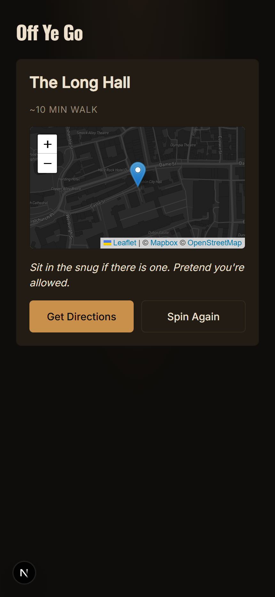

# Off Ye Go

Can't pick a pub? Off ye go. We'll pick one for you.

<p align="center">
  
</p>

## What it does

Dublin has over 700 pubs. The island has over 7,000. None of that helps when you're standing on a footpath at six on a Friday and someone asks where you want to go.

Off Ye Go picks one for you, at random, within walking distance of where you're standing. You get the name, a walking time, a map, and a small dare to do once you arrive. The app talks to you in one of two Irish voices, neither of which is impressed with you. Republic of Ireland only, by design.

## Two personalities

Off Ye Go ships with two distinct voices, each with its own visual theme. The Grumpy Barman is dry, sparse, tired-of-you. Dark backgrounds, warm amber pendant-lamp accent, a dark street map. The Local Lad is louder and friendlier, full of "ya" and "feckin'" and Sunday-afternoon energy. Deep Irish green, GAA red accent, a terrain-focused map.

Both personalities run on the same engine. The user toggles between them on the ready screen; the entire app's mood changes in place -- copy, colour, typography, map style, even a small signature animation on the age gate. Every user-facing string lives in a personality voice file; no hardcoded English in components.

## Status

In active development. Targeted launch on offyego.ie when ready.

## Stack

Built on Next.js 16 with React 19 and the App Router, written in TypeScript with strict mode on, styled with Tailwind v4, tested with Vitest. The map is Leaflet rendering Mapbox raster tiles (dark-v11 for the Grumpy Barman theme, outdoors-v12 for the Local Lad theme). Pub data comes from the Overpass API against OpenStreetMap, fetched through a thin /api/overpass proxy route that handles upstream content negotiation. Hosted on Vercel. Minimal backend (one Overpass proxy route, no business logic). No database. No accounts. Just a button and a pub.

## Running it locally

```bash
npm install
npm run dev
```

Then open http://localhost:3000. Browser geolocation works on localhost over HTTP by browser exemption. To test on a real mobile device over your LAN (e.g., `http://192.168.x.x:3000`), HTTPS is required -- use Vercel preview deployments for mobile testing.

## Contributing

PRs welcome. The project has a strong opinionated voice, so please read MASTER_PROMPT.md before opening one. No em-dashes in user-facing copy. No emoji in UI. If you're adding a challenge or voice variant, follow the existing tone.

## Licence

MIT. See LICENSE.
